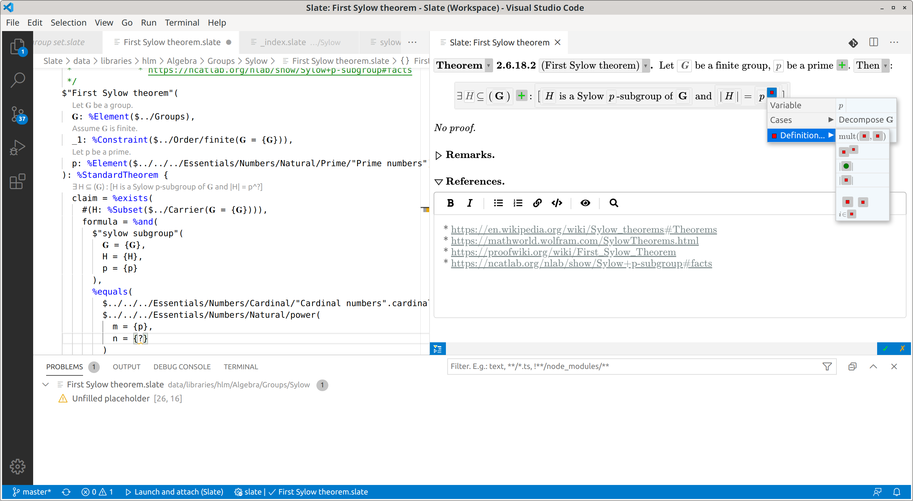

# Slate

This extension integrates the [Slate interactive theorem prover](https://sreichelt.github.io/slate) into Microsoft Visual Studio Code.



## Features

* Full integration of the web-based graphical editor, with bidirectional synchronization between source code and graphical editor.
* Syntax highlighting.
* Display of syntax and type errors.
* Inline preview of rendered mathematical content.
* "Go To Definition" for objects, argument names, and variables.
* Signature help for parameter lists.
* Context-sensitive auto-completion (triggered automatically and via Ctrl+Space).
* Document and workspace symbols.
* "Find All References".
* "Rename Symbol".
* Updating references when renaming and moving files.
* "Format Document".

## Usage

At the moment, some features look for certain files in predefined locations inside the workspace. Therefore, please clone the [slate](https://github.com/SReichelt/slate) repository recursively, i.e.
```
git clone --recursive https://github.com/SReichelt/slate.git
```
If you have a personal fork of the [slate-hlm](https://github.com/SReichelt/slate-hlm) repository (e.g. created automatically by the web GUI), add it as a remote to the submodule `data/libraries/hlm`.

Then open the workspace `Slate.code-workspace` in Visual Studio Code, and start editing `.slate` files in the `data/libraries/hlm` subdirectory.

To let Slate adapt references when moving files or directories, consider increasing the `files.participants.timeout` setting in Visual Studio Code.

## Download

Continuously updated builds of the Slate VSCode extension are available at https://slate-prover.herokuapp.com/public/download/slate.vsix. That file is guaranteed to match the online version of the theorem prover.
